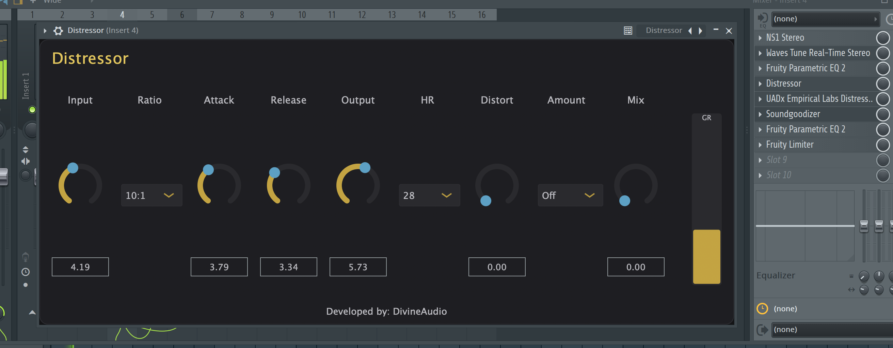

# Distressor

Tube-style compressor with punch and character. Suited for drums, bass, and mix bus.

## Downloads

| Platform | Format | File |
|----------|--------|------|
| macOS | AU | [Distressor.component.zip](mac/Distressor.component.zip) |
| macOS | VST3 | [Distressor.vst3.zip](mac/Distressor.vst3.zip) |
| Windows | VST3 | [Distressor.vst3](windows/Distressor.vst3) |

## Install

- **macOS:** Unzip and move to `~/Library/Audio/Plug-Ins/Components` (AU) or `~/Library/Audio/Plug-Ins/VST3` (VST3).
- **Windows:** Copy the `Distressor.vst3` folder into your VST3 folder, then rescan in your DAW.
