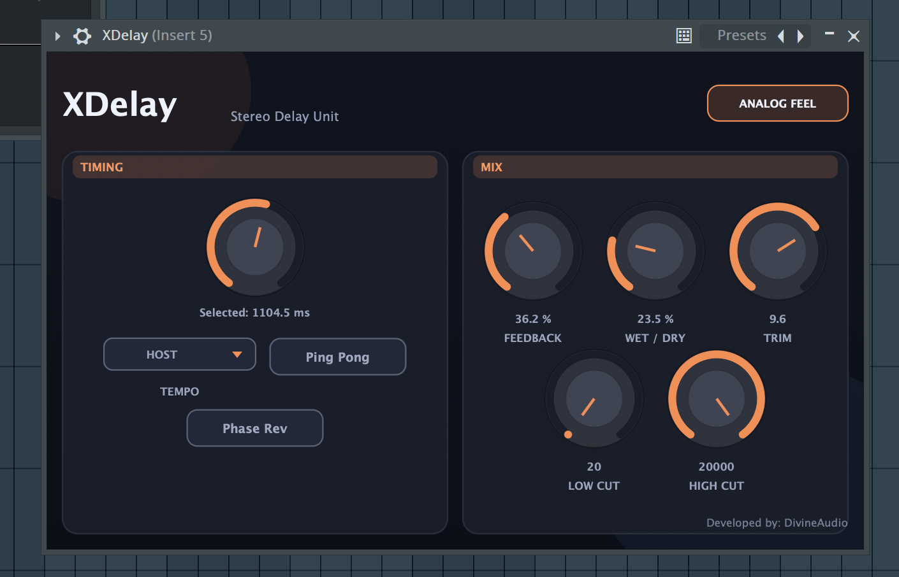

# Divine Audio — Free Plugins

Free VST3/AU audio plugins from Divine Audio. No sign-up, no paywall.

## Plugins

### Distressor

Tube-style compressor with character. Punch and glue for drums, bass, and mix bus.

| macOS (AU, VST3) | Windows (VST3) |
|------------------|----------------|
| [Distressor.component.zip](Distressor/mac/Distressor.component.zip) · [Distressor.vst3.zip](Distressor/mac/Distressor.vst3.zip) | [Distressor.vst3](Distressor/windows/Distressor.vst3) |

---

### XDelay

Delay effect for echoes and spatial effects.

| macOS | Windows (VST3) |
|-------|----------------|
| — | [XDelay.vst3](XDelay/windows/XDelay.vst3) |

---

## Install

- **macOS:** Unzip and move `.component` to `~/Library/Audio/Plug-Ins/Components`, or `.vst3` to `~/Library/Audio/Plug-Ins/VST3`.
- **Windows:** Copy the `.vst3` folder into your VST3 folder (e.g. `C:\Program Files\Common Files\VST3`).

Rescan plugins in your DAW after installing.
